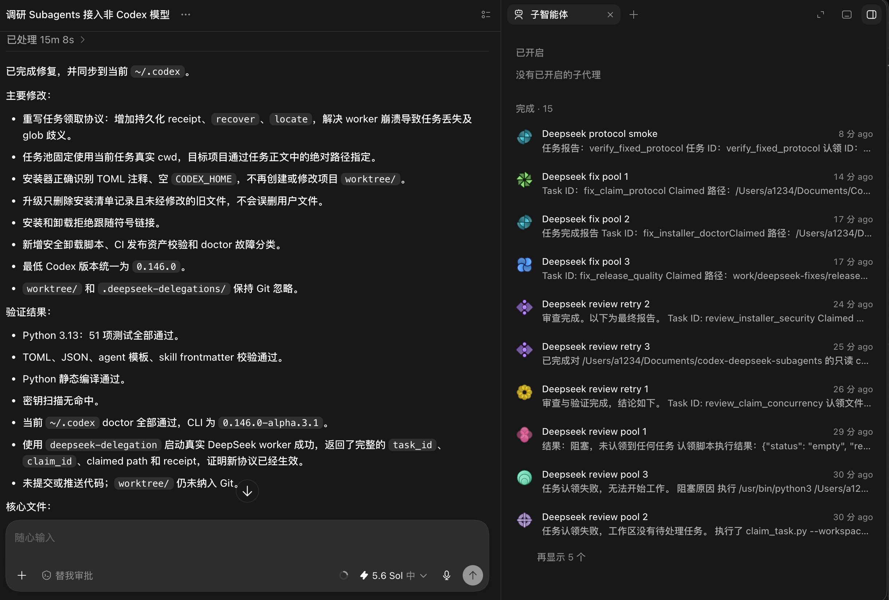

# Codex DeepSeek Subagents

[中文](README.md) · [Architecture](ARCHITECTURE.md)

This project lets Codex Desktop use `deepseek-v4-flash` as a subagent model and dispatch multiple independent work items from one parent task.

> This is a third-party integration. It is not a Codex plugin published by OpenAI or DeepSeek. The repository does not contain a `.codex-plugin/plugin.json`; its installer writes Codex agent, model catalog, model provider, and skill configuration files.



The screenshot comes from a local test. The right pane shows several DeepSeek workers running review, implementation, and protocol-check tasks. Names, counts, and UI details depend on the prompt and Codex version.

## How it works

In the tested environment, native parent-to-child messages for a custom provider may reach DeepSeek without the complete task body or task name. This project passes task bodies through workspace files while keeping Codex Desktop's subagent list, tool execution, and result reporting:

```text
Parent splits independent tasks
  → writes .deepseek-delegations/pending/
  → creates one or more deepseek_worker agents
  → each worker atomically claims one task into claimed/
  → worker returns task_id, claim_id, path, and receipt
  → parent inspects the files and test results
```

The claim script uses an atomic rename on one filesystem so two workers cannot claim the same task. Receipts make claimed tasks recoverable when a result is not delivered. `recover` does not decide whether a worker is dead; the parent must confirm that before requeueing work.

## Verified scope

- macOS
- Codex Desktop and Codex CLI `0.146.0-alpha.3.1`
- Python 3.9 and 3.13; CI uses Python 3.11
- `deepseek-v4-flash`
- DeepSeek Responses API base URL `https://api.deepseek.com`
- A `deepseek-api-key` item in macOS Keychain

`models/deepseek-v4-flash.json` currently declares `minimal_client_version: 0.146.0`. This is the project's client version gate, not evidence that every earlier or later Codex version has been tested.

DeepSeek's current documentation lists `deepseek-v4-flash`, identifies the deployed version as `DeepSeek-V4-Flash-0731`, and documents Responses API support for that model:

- [DeepSeek API quick start](https://api-docs.deepseek.com/)
- [DeepSeek Responses API compatibility](https://api-docs.deepseek.com/guides/responses_api/)

## Installation

### Requirements

- macOS
- Codex Desktop installed and signed in
- `git` and `python3`
- A valid DeepSeek API key

### Clone and install

```bash
git clone https://github.com/wongchisum/codex-ds-sub-agents.git
cd codex-ds-sub-agents
python3 scripts/install.py
```

The installer:

- installs `deepseek_worker` under `~/.codex/agents/`
- installs the model catalog under `~/.codex/models/`
- installs the `deepseek-delegation` skill under `~/.codex/skills/`
- appends the DeepSeek provider to `~/.codex/config.toml` when it is absent
- creates timestamped backups before replacing project-managed files that have changed

It does not modify the repository's `worktree/`. During a skill upgrade, it removes only files recorded in the old install manifest that are absent from the new version and have not been modified by the user.

### Store the API key

Do not put the key in a README, prompt, Git configuration, or task file. Run:

```bash
/usr/bin/security add-generic-password -U -a codex -s deepseek-api-key -w
```

With `-w` as the final option and no value, macOS `security` reads the password interactively, so it does not appear in shell history.

Then check the installation:

```bash
python3 scripts/doctor.py
```

`doctor.py` checks installed files, the Keychain item, and Codex strict-config loading. It does not call DeepSeek and does not verify network access, account balance, or a real model request.

Start a new Codex task after installation. If the new task still does not discover `deepseek-delegation` or uses old agent instructions, restart Codex Desktop. Whether a restart is required depends on which files the running Desktop process has already cached.

## Prompt Codex to install it

Send the complete prompt below to Codex. Do not paste the DeepSeek API key into the conversation. Codex should stop and let you enter it locally when Keychain setup is required.

```text
Install and verify Codex DeepSeek Subagents from:
https://github.com/wongchisum/codex-ds-sub-agents

Requirements:
1. Confirm that the system is macOS. Run codex --version and python3 --version and report their real output; do not infer compatibility.
2. If the repository is absent, clone it into a writable development directory. If it already exists, inspect the working tree first and preserve uncommitted changes.
3. Read README_EN.md, scripts/install.py, config/deepseek-provider.toml, agents/deepseek-worker.toml.template, and models/deepseek-v4-flash.json. Report which ~/.codex files the installer will change.
4. Run python3 scripts/install.py. Never put the API key in a command, file, log, or conversation.
5. After installation, stop and ask me to run this command in my local terminal:
   /usr/bin/security add-generic-password -U -a codex -s deepseek-api-key -w
6. After I confirm that the key is stored, run python3 scripts/doctor.py.
7. Report modified files, backups, doctor results, and anything not verified. doctor does not make a real API call, so do not describe a PASS as end-to-end success.
8. Do not commit, push, or modify Git remotes. Do not read or print the Keychain secret.
```

If Codex cannot write to `~/.codex`, it should request narrowly scoped filesystem approval instead of installing somewhere else and reporting success.

## Usage

Add this to the target project's `.gitignore`:

```gitignore
/.deepseek-delegations/
```

Then prompt Codex:

```text
Use $deepseek-delegation. Put the following two independent tasks into one task pool and create two deepseek_worker agents at the same time, both with fork_turns: "none". The parent agent should only split the work, wait, and perform final verification.

Task one, ID analyze_auth:
Analyze call relationships and error boundaries in src/auth. Do not edit files. Report file and line evidence.

Task two, ID test_users:
Run the user-module tests and find the root cause. Only tests/users may be changed. Rerun the relevant tests after the change.

Acceptance:
1. Each worker returns a distinct task_id, claim_id, claimed path, and receipt.
2. Each worker performs only the task it claimed.
3. The parent checks the real files and test output and reports the worker-to-task mapping.
```

Each task should define its objective, allowed files, edit permissions, expected output, and verification command. Do not parallelize tasks that depend on the same uncommitted changes. Concurrency is limited by the available Codex agent slots; larger batches run in waves.

See [examples/parallel-prompt.md](examples/parallel-prompt.md) for another copyable example.

## Local test directory

The repository's `worktree/` directory is reserved for isolated subagent tests:

```text
worktree/
  task-001/
  task-002/
```

Both `worktree/` and the repository root's `.deepseek-delegations/` are ignored by Git and must not be committed. Target projects must ignore their own `.deepseek-delegations/` directory separately.

## Verification

```bash
python3 -m unittest discover -s tests -v
python3 scripts/doctor.py
```

End-to-end verification requires creating at least one real `deepseek_worker` in Codex Desktop and confirming that it can claim a task, use the required tools, and return a result. A passing `doctor.py` check alone is not end-to-end proof.

## Uninstall

Preview first:

```bash
python3 scripts/uninstall.py --dry-run
```

Then uninstall:

```bash
python3 scripts/uninstall.py
```

The uninstaller removes only agent, model, and skill files that exactly match the current project content. Modified files, unknown files, and symlinks are preserved. It removes the provider block only when that block exactly matches the project template and is at the end of `config.toml`; it creates a backup before changing the config.

## Limitations and security boundaries

- Authentication currently depends on macOS Keychain. Linux and Windows are not supported.
- Task bodies are plaintext workspace files. Never put secrets, access tokens, or private user data in them.
- Worker requests are sent to the DeepSeek API, not the OpenAI API. Confirm that the code and data may be shared with that service.
- The model catalog declares text input only. Do not rely on image input.
- DeepSeek implements only part of the OpenAI Responses API surface. Refer to [DeepSeek's compatibility table](https://api-docs.deepseek.com/guides/responses_api/) for supported fields and tools.
- Custom agent, model catalog, and provider configuration may change between Codex releases. Rerun the tests and a real-worker check after upgrading Codex.
- A crashed worker is not requeued automatically. The parent must confirm that it has stopped before using `recover`.
- The repository does not yet include an open-source license. Default copyright restrictions apply until one is added.

See [ARCHITECTURE.md](ARCHITECTURE.md) for the mailbox protocol and recovery flow.

## Links
https://linux.do/
