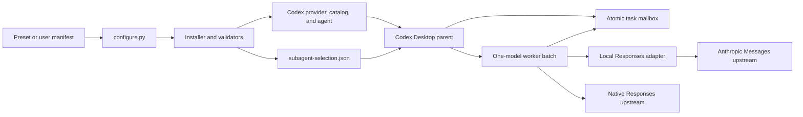

# Architecture

English · [简体中文](zh-CN/ARCHITECTURE.md)

## Goal

The system separates Codex-loadable providers and agents from the provider's actual wire protocol. A configuration may declare several candidate models, but one run uses one active agent for the whole worker batch. After an eligible exhausted transport failure, the parent stops the old batch and switches to the next candidate.



## Components

| Component | Responsibility |
| --- | --- |
| `scripts/configure.py` | Select presets or a manifest; persist a stable copy; orchestrate credential checks, install, doctor, and redacted logs |
| `scripts/model_manifest.py` | Validate manifests and render providers, catalogs, agents, and selection |
| `scripts/install.py` | Atomic install, backup, ownership registration, and adapter startup |
| `scripts/uninstall.py` | Digest/owner-safe removal and previous-selection restoration |
| `scripts/doctor.py` | Check installation, credential references, strict configuration, and service identity |
| `scripts/adapter_service.py` | Manage macOS LaunchAgent or Windows Task Scheduler and verify service fingerprints |
| `scripts/credential_store.py` | Read macOS Keychain or Windows Credential Manager without moving values into arguments or manifests |
| `scripts/diagnostics.py` | Export bounded, redacted installation, service, log, and receipt evidence |
| `scripts/anthropic_responses_adapter.py` | Expose a local Responses HTTP/SSE service backed by Anthropic Messages |
| `scripts/anthropic_adapter_protocol.py` | Convert messages, tools, results, errors, and stream events |
| `scripts/model_selection.py` | Validate selection and classify switch-eligible failures |
| `skills/codex-custom-subagents/scripts/delegation_runtime.py` | Persist active model, failure, generation, and fallback state |
| `skills/codex-custom-subagents/scripts/claim_task.py` | Atomically claim, complete, fail, locate, and recover tasks |
| `skills/codex-custom-subagents/scripts/platform_lock.py` | Provide POSIX `fcntl` and Windows `msvcrt` mailbox locking |
| `scripts/platform_runtime.py` | Resolve platform-aware Python commands, Codex executable, service paths, and quoting |
| `scripts/session_audit.py` | Verify actual agent, model, context window, follow-ups, and errors from a rollout |

## Request paths

Native Responses provider:

```text
Codex worker → provider.base_url /responses → provider Responses API
```

Anthropic Messages provider:

```text
Codex worker
  → http://127.0.0.1:<port>/responses
  → Responses/Anthropic conversion
  → https://<upstream>/v1/messages
```

Codex always sees `wire_api = "responses"`. A schema v2 provider declares the real protocol with `upstream_protocol`. `anthropic_messages` derives a local adapter; `provider.base_url` remains the real upstream URL. Model names do not affect protocol selection.

## One active model and fallback

`subagent-selection.json` records the primary, ordered fallbacks, and the agent for every candidate. `delegation_runtime.py begin` freezes one active agent and generation for the run.

```text
active batch exhausts a transport failure
  → wait for and stop old workers
  → classify the recorded failure
  → increment generation
  → recover only incomplete claims
  → rebuild the batch with the new active.agent
```

A run never returns to an attempted model and never exceeds `max_switches`. Authentication, invalid request, missing model, task failure, and unknown errors block instead of switching.

## Atomic task mailbox

Some custom providers do not receive a complete native child-task body. The Skill therefore keeps full task handoffs under the parent task's real current working directory:

```text
.deepseek-delegations/
├── pending/     # ready to claim
├── claimed/     # atomically claimed, with receipts
├── rejected/    # invalid protocol headers or tasks
├── recovered/   # explicitly recovered attempts
└── runs/        # active model and fallback state
```

The parent writes every complete task before spawning a worker. A worker uses an atomic rename from `pending` to `claimed`, then writes a durable receipt. Task IDs match `[a-z0-9_]{1,64}`. The pool resolves symlinks and binds to the real process cwd.

Recovery never guesses that a worker died. The parent first confirms old workers stopped, then recovers by exact task ID, claim ID, or a confirmed `--all`. Ambiguous locate operations fail instead of selecting an arbitrary claim.

## Installation ownership

The stable managed manifest path is hashed into an installation ID. The registry records file digests, provider fingerprints, owners, installation order, and selection. Shared Skill or adapter files remain until their last owner is removed.

New configurations are copied to `~/.codex/custom-subagents/manifests/<name>.json`, so moving the repository checkout does not change their installation identity. Old fixed DeepSeek installs use content comparison and `.codex-deepseek-manifest.json` for compatible safe removal.

## Security boundaries

- Adapters listen only on loopback; `/health` verifies both `service_id` and an upstream-bound fingerprint.
- Manifests store credential references, never credential values.
- Upstream redirects are not followed with authorization headers.
- Adapter audit records structural metadata, not prompts, task bodies, or credentials.
- Mailbox files are plaintext; task bodies must not contain keys or tokens.
- Workers cannot recursively spawn subagents or request user input; the parent owns those decisions.

## Current limits

- The managed desktop platforms are macOS and Windows; they use different credential and service backends.
- One adapter provider currently binds one model catalog.
- Codex providers use the Responses runtime; other upstream protocols need an adapter.
- Catalog context declarations do not prove the actual Desktop `model_context_window`.
- Images, provider-hosted search, and encrypted task blocks are not translated across protocols.
