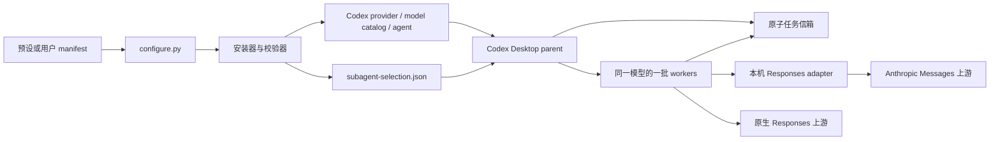

# 系统架构

## 设计目标

系统把「Codex 可加载的 provider/agent」和「供应商真实协议」分开。用户声明多个候选模型，运行时只选择一个 agent 创建整批 worker；传输故障满足规则时，父任务停止旧批次，再切换到下一候选模型。



## 模块职责

| 模块 | 职责 |
| --- | --- |
| `scripts/configure.py` | 接收协议优先的 manifest，兼容旧 profile，稳定保存配置，编排凭证、安装、doctor 和脱敏日志 |
| `scripts/model_manifest.py` | 校验 manifest，生成 provider、model catalog、agent 和 selection |
| `scripts/install.py` | 原子安装、备份、所有权登记、adapter 启动 |
| `scripts/uninstall.py` | 按摘要和 owner 安全卸载，恢复旧 selection |
| `scripts/doctor.py` | 检查安装、凭证引用、严格配置和服务身份 |
| `scripts/adapter_service.py` | 管理 macOS LaunchAgent / Windows Task Scheduler，验证健康与 fingerprint |
| `scripts/credential_store.py` | 统一读取 macOS Keychain / Windows Credential Manager，禁止凭证进入参数和 manifest |
| `scripts/diagnostics.py` | 导出有大小上限的脱敏安装、服务、日志和任务回执证据 |
| `scripts/anthropic_responses_adapter.py` | 提供本机 Responses HTTP/SSE 服务，调用上游 Anthropic Messages |
| `scripts/anthropic_adapter_protocol.py` | 转换消息、工具、结果、错误和流事件 |
| `scripts/model_selection.py` | selection 数据结构与可切换错误分类 |
| `scripts/delegation_runtime.py` | 持久化每次运行的 active model、失败和 fallback generation |
| `skills/deepseek-delegation/scripts/claim_task.py` | 原子领取、完成、失败、定位和恢复任务 |
| `skills/deepseek-delegation/scripts/platform_lock.py` | POSIX fcntl / Windows msvcrt 字节范围文件锁抽象 |
| `scripts/platform_runtime.py` | 平台感知的 Python 命令、Codex 发现、服务路径与命令构造 |
| `scripts/session_audit.py` | 从原生 rollout 核验实际 agent、模型、窗口与结果 |

## 两条请求路径

原生 Responses Provider：

```text
Codex worker → provider.base_url /responses → 供应商 Responses API
```

Anthropic Messages Provider：

```text
Codex worker
  → http://127.0.0.1:<port>/responses
  → Responses/Anthropic 协议转换
  → https://<upstream>/v1/messages
```

Codex 只看到 `wire_api = "responses"`。schema v2 的 Provider 用 `upstream_protocol` 声明真实协议；`anthropic_messages` 会自动派生本机 adapter。manifest 的 `provider.base_url` 始终表示真实上游，模型名不参与协议判断。

## 单模型覆盖与 fallback

`subagent-selection.json` 保存 primary、fallback 顺序和每个候选模型对应的 agent。运行开始时，`delegation_runtime.py begin` 固化 active agent 和 generation。整批 worker 必须使用同一 agent。

切换顺序：

```text
active batch 失败
  → 等待并停止旧 worker
  → 记录已耗尽的传输错误
  → 分类允许切换
  → generation + 1
  → 仅恢复未完成 claim
  → 使用新 active.agent 重建整批 worker
```

系统不会在一个运行中返回已经尝试过的模型，也不会超过 `max_switches`。

## 原子任务信箱

部分自定义 provider 收到的原生子任务消息可能缺少完整任务正文。skill 因此在父任务真实 cwd 下维护：

```text
.deepseek-delegations/
├── pending/     # 尚未领取
├── claimed/     # 已原子领取，含 receipt
├── rejected/    # 协议头损坏或无法执行
├── recovered/   # 人工确认后的恢复记录
└── runs/        # 运行与 fallback 状态
```

父任务先写完整文件，再创建 worker。worker 用同一文件系统内的原子 rename 从 `pending` 移到 `claimed`，随后写入 receipt。`task_id` 必须匹配 `[a-z0-9_]{1,64}`。池路径用 `Path.resolve()` 绑定真实 cwd；`--allow-workspace-mismatch` 只用于明确的旧版兼容。

`recover` 不猜测 worker 是否已经死亡。父任务必须先确认 worker 停止，再按 `task_id`、`claim_id` 或 `--all` 恢复。`locate` 发现多个同名 claim 时返回歧义错误，不会随便选一个。

## 安装所有权

manifest 的绝对路径经过哈希成为 installation ID。登记表记录每个托管资源的摘要和 owners。这个设计让多个 manifest 共用 skill 或 adapter 时，卸载其中一个不会删除另一安装仍在使用的文件。

统一配置入口先把 manifest 保存到
`~/.codex/custom-subagents/manifests/<name>.json`。installation ID 因此不再依赖仓库 clone
目录；用户可以移动源码目录而不改变新安装的所有权身份。

旧版固定 DeepSeek 安装没有通用登记表时，仍使用内容比对和 `.codex-deepseek-manifest.json` 保护用户修改。两种安装可以共存。

## 安全边界

- adapter 只监听 loopback；`/health` 同时核对 `service_id` 和绑定上游的 fingerprint。
- manifest 只保存 Keychain service 或环境变量名，不保存凭证值。
- 上游 30x 不跟随，避免 Authorization Header 被发送到另一地址。
- adapter 审计不记录 Prompt、任务正文或凭证。
- 任务信箱是明文文件，任务正文不得包含 Key、token 或其他秘密。
- worker 不能递归创建 sub-agent，也不能直接等待用户输入；这些工具会在适配层过滤。

## 已知限制

- LaunchAgent 与 Keychain 集成目前是 macOS 专用。
- 当前每个 adapter Provider 只能绑定一个 model catalog。
- provider runtime 只支持 `responses`；其他协议必须先适配。
- catalog 上下文声明不保证 Desktop 的实际 `model_context_window`。
- 图像、供应商托管搜索工具和加密任务块没有跨协议转换。
